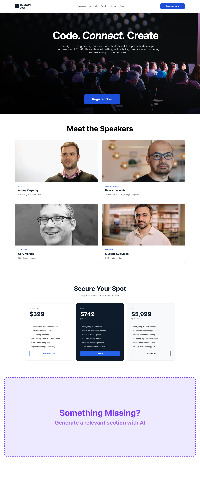
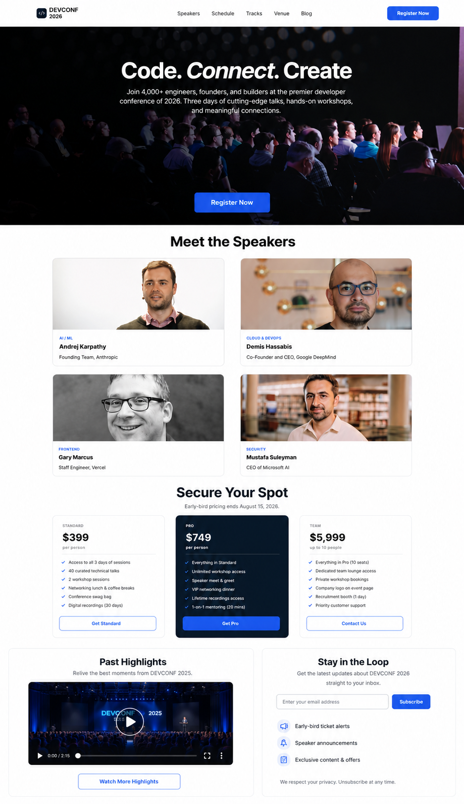

My prompt:give me a suggestion for a section of this website design. I want a Newsletter Signup section or Past Highlights section design at bottom. Now give me a idea for make this new section.

Chat GPT Replies: Your current landing page is very clean and modern. Since you already have:

✅ Hero
✅ Speakers
✅ Pricing
⬜ Empty bottom section

A new section should increase conversions, not just fill space.

Option 1 (Recommended): Newsletter Signup + Community (Best for this design)

This fits perfectly after the pricing section because users who aren't ready to buy can still stay connected.

Layout
---------------------------------------------------------
        Stay in the Loop 🚀
Never miss speaker announcements, discounts,
and conference updates.

   [ Your Email Address                 ]
                    [ Subscribe ]

✔ Speaker announcements
✔ Early bird discounts
✔ Workshop updates
✔ Exclusive resources

Trusted by 12,000+ developers worldwide
---------------------------------------------------------
Design Style
White background
Large heading
Small description
Rounded input
Blue CTA button
Tiny icons with benefits underneath
Light gradient or subtle blue glow

Example colors

Background: #F8FAFC
Button: #2563EB
Border: #E5E7EB
Option 2 (My Favorite): Past Highlights

Instead of a boring gallery, create a conference memory section.

Layout
---------------------------------------------------------
           DevConf 2025 Highlights

      [ Large Video Thumbnail ]
      ▶ Watch Recap

------------------------------------------
15K+
Attendees

220+
Speakers

60+
Workshops

48
Countries

97%
Would Attend Again
------------------------------------------

Gallery
[image] [image] [image] [image]
---------------------------------------------------------
Design

Large heading

One featured video

Statistics underneath

Small image gallery

Blue play button

Looks premium and professional.

Option 3 (Best Overall)

Combine both into one section.

---------------------------------------------------------
                Highlights from 2025

        [ Video Thumbnail ]

15K Attendees     220 Speakers
60 Workshops      48 Countries

-----------------------------------------

Stay Updated

Join 12,000+ developers and receive
conference news directly in your inbox.

[ Email Address________________ ]
                 [ Subscribe ]
---------------------------------------------------------

This gives visitors:

social proof
event credibility
email collection
Suggested Visual Layout
┌──────────────────────────────────────────────────────────────────────────────┐
│                     DevConf 2025 Highlights & Community                      │
│                                                                              │
│ ┌──────────────────────────────┐  ┌───────────────────────────────────────┐  │
│ │                              │  │ Stay in the Loop 🚀                  │  │
│ │      ▶ Watch Recap           │  │                                       │  │
│ │                              │  │ Get speaker announcements,            │  │
│ │      Video Thumbnail         │  │ workshop updates & early-bird offers. │  │
│ │                              │  │                                       │  │
│ └──────────────────────────────┘  │ [ Your Email Address____________ ]    │  │
│                                   │                [ Subscribe ]           │  │
│                                   │                                       │  │
│                                   │ ✓ Early-bird Discounts                │  │
│                                   │ ✓ Speaker News                        │  │
│                                   │ ✓ Workshop Updates                    │  │
│                                   └───────────────────────────────────────┘  │
│                                                                              │
│                                                                              │
└──────────────────────────────────────────────────────────────────────────────┘
Extra UI Details
Add a subtle blue-to-purple gradient background (#F8FAFC → #EEF4FF).
Use rounded corners (24px) and generous padding (80–100px top/bottom).
Include a floating play button with a slight shadow on the recap video.
Animate the statistics counters when they scroll into view.
Add a soft hover effect on the Subscribe button and video card.
Final Recommendation

For a developer conference website like yours, I'd build a single "Past Highlights + Newsletter Signup" section at the bottom. It feels complete, adds credibility through real event metrics and media, and captures email leads from visitors who aren't ready to register yet. It also matches the clean, premium aesthetic of the rest of your landing page.

My prompt: generate the image as your consept.

Chat GPT replies: 